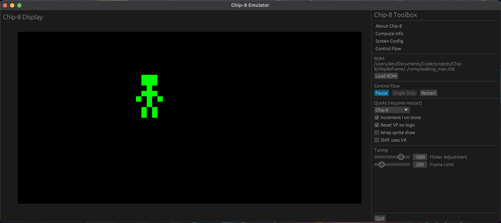
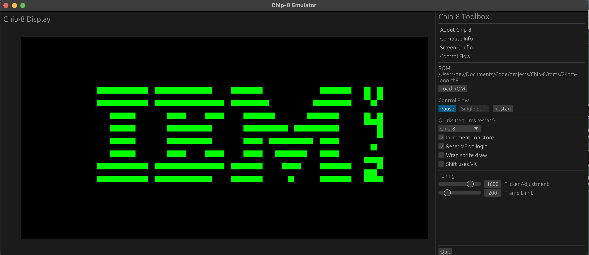
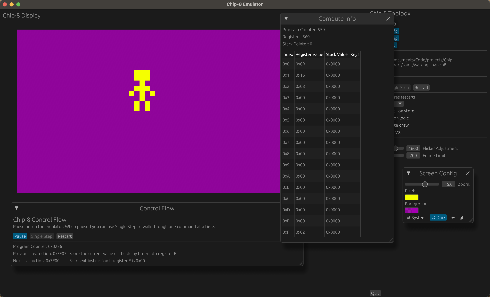
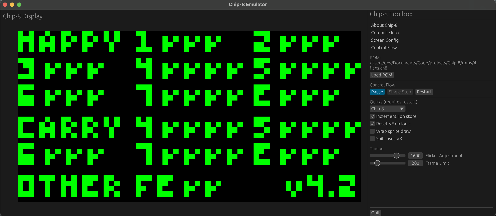
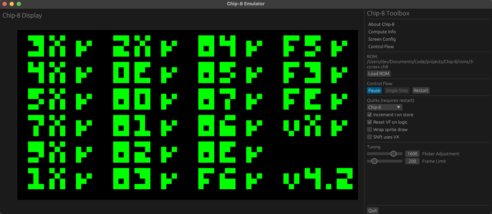

# CHIP-8 eframe

Desktop GUI for the CHIP-8 emulator built with egui/eframe.

Project repository:
https://github.com/nebulous-code/chip-8

Related crates:
- https://crates.io/crates/chip8sys (v0.1.0)
- https://crates.io/crates/chip8wasm (v0.1.0)

## Screen Shots

Special thanks to [Timendus' CHIP-8 Test Suite](https://github.com/Timendus/chip8-test-suite)

IBM Logo displayed on the CHIP-8

Settings, control flow, and registry detail information available in pop up windows.

Flags tests passing.

Corax+ test suite passing.

## Run

In this folder:

- `cargo run`
- `cargo run --release`

The app opens a window with a CHIP-8 screen, a toolbox for ROMs, and controls
for running, pausing, stepping, and resetting.

## Notes

- The ROM path is resolved relative to the crate directory.
- The window icon is loaded from `assets/icon-256.png`.
- ROM files use the `.ch8` extension.

## Linux dependencies

On Ubuntu/Debian:

`sudo apt-get install libxcb-render0-dev libxcb-shape0-dev libxcb-xfixes0-dev libxkbcommon-dev libssl-dev`

On Fedora Rawhide:

`dnf install clang clang-devel clang-tools-extra libxkbcommon-devel pkg-config openssl-devel libxcb-devel gtk3-devel atk fontconfig-devel`
